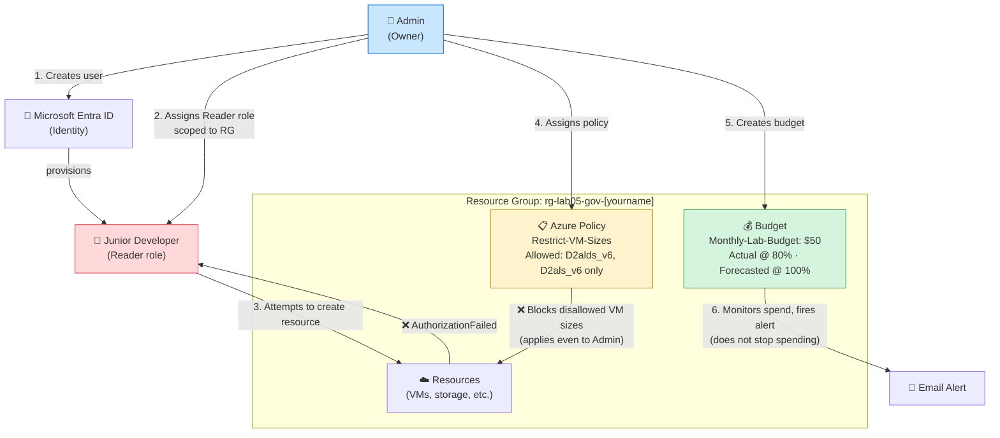

# Lab 05: Implementing Governance and Security Hardening

**Platform:** Microsoft Azure
**Tools:** RBAC · Azure Policy · Cost Management · NIST Cybersecurity Framework

---

## 📌 Overview

This lab builds three layers of cloud governance inside a single resource group: **who can act** (RBAC), **what configurations are allowed** (Azure Policy), and **awareness of spend** (Cost Management budgets). Each control is deployed, then deliberately tested to confirm it actually blocks (or alerts on) what it's supposed to. The lab is framed around the **NIST Cybersecurity Framework (CSF)**, mapping each phase to one of its five functions: Identify, Protect, Detect, Respond, and Recover.

**Key concepts practiced:**
- Least-privilege access via RBAC role assignments scoped to a resource group
- Deny-by-default identity in Microsoft Entra ID
- Azure Policy as a configuration guardrail that applies even to Owner accounts
- Actual vs. Forecasted budget alerts
- Mapping hands-on cloud work to the NIST CSF functions

---

## 🏗️ Architecture Diagram



**The flow:** the Admin creates a Junior Developer identity and grants only Reader access, scoped to one resource group. When that user tries to create anything, Azure blocks the action before it happens. Separately, an Azure Policy assignment blocks any VM outside an approved size list, for everyone, including the Admin. A budget watches spend at the resource group level and fires an email alert on both actual and forecasted thresholds, but never stops spending on its own.

---

## 🧭 NIST Cybersecurity Framework Mapping

| NIST Function | What it means | Where it shows up in this lab |
|---|---|---|
| **Identify** | Know what you have and who has access | Creating the Junior Developer user in Microsoft Entra ID before granting any permissions |
| **Protect** | Limit what can go wrong | The Reader role assignment (RBAC) and the VM size policy (Azure Policy) |
| **Detect** | Know when something abnormal is happening | The budget alert firing on unexpected spend |
| **Respond** | Have a plan for when something goes wrong | Receiving and investigating a budget alert |
| **Recover** | Restore normal operations after an incident | Cleanup phase, deleting the test user and resource group |

---

## ✅ Prerequisites

- [ ] Active Azure Subscription
- [ ] Incognito/private browser window available (to test as a second user without logging out of Admin)
- [ ] ~10 minutes of patience after each policy assignment (propagation takes 10 to 30 minutes)

---

## 🏷️ Naming Conventions & Variables

| Resource | Name | Notes |
|---|---|---|
| Resource Group | `rg-lab05-gov-[yourname]` | Scope for every control in this lab |
| Test User (UPN) | `junior-dev-[yourname]@[yourtenant].onmicrosoft.com` | |
| Test User (display name) | `Junior Developer` | |
| Policy Assignment | `Restrict-VM-Sizes` | Allowed SKUs: `Standard_D2alds_v6`, `Standard_D2als_v6` |
| Budget Name | `Monthly-Lab-Budget` | $50/month |
| Region | Central US | |

---

## 🚀 Step-by-Step Instructions

### Phase 1 — Create the Lab Resource Group

1. Sign in to the Azure Portal.
2. **Resource groups → + Create.**
3. Name: `rg-lab05-gov-[yourname]` · Region: `Central US`.
4. **Review + create → Create.**

Every governance control in this lab is scoped to this single resource group, so testing stays contained.

### Phase 2 — RBAC: Create a User and Restrict Their Access

**Step 1 — Create the user (Microsoft Entra ID):**

1. **Microsoft Entra ID → Users → + New user → Create new user.**
2. User principal name: `junior-dev-[yourname]` (tenant domain appends automatically).
3. Display name: `Junior Developer`.
4. Under Password, uncheck **Auto-generate password** and set one you'll remember.
5. **Review + create → Create.**

**Step 2 — Assign the Reader role, scoped to the resource group:**

1. **rg-lab05-gov-[yourname] → Access control (IAM) → + Add → Add role assignment.**
2. Role: **Reader** → Next.
3. Members: **+ Select members** → search for **Junior Developer** → Select.
4. **Review + assign** (twice to confirm).

> **Why this matters:** Azure denies by default, creating a user grants zero access. The Reader role, scoped only to this resource group, lets the Junior Developer view everything inside it but nothing else in the subscription.

### Phase 3 — Verify Access: The "Permission Denied" Test

1. Open an **Incognito/private window** → `portal.azure.com`.
2. Sign in as `junior-dev-[yourname]@[yourtenant].onmicrosoft.com`. Complete MFA setup if prompted.
3. Confirm only `rg-lab05-gov-[yourname]` is visible under Resource Groups.
4. Inside that group, try **+ Create → Storage Account** → fill in any name → **Review + create**.

**Expected result:** a red "AuthorizationFailed" or permission-denied error. This confirms the Reader role blocks write actions as designed.

### Phase 4 — Azure Policy: Prevent Expensive Configurations

1. Search **Policy → Assignments (under Authoring) → Assign policy.**
2. **Basics:**
   - Scope: your subscription → resource group `rg-lab05-gov-[yourname]`
   - Policy definition: search **"Allowed virtual machine size SKUs"** → Add
   - Assignment name: `Restrict-VM-Sizes`
3. **Parameters tab:** uncheck "Only show parameters that need input," then set **Allowed Size SKUs** to `Standard_D2alds_v6` and `Standard_D2als_v6`.
4. **Review + create → Create.**

> ⚠️ **Propagation delay:** policy assignments take 10 to 30 minutes to take effect. If Phase 5 doesn't block immediately, wait and retry, this is expected, not a failure.

> **Why this matters:** Azure Policy applies to everyone, including Owner accounts. A Deny policy can't be bypassed by elevating your own permissions, that's intentional.

### Phase 5 — Test the Policy

1. In `rg-lab05-gov-[yourname]` → **+ Create → Virtual Machine.**
2. Name it anything, select Ubuntu Server.
3. Size: **See all sizes → Standard_D2alds_v7** (not on the allowed list) → **Review + create.**

**Expected result:** "Validation failed", expand the error to see `Restrict-VM-Sizes` listed as the reason.

4. Repeat with size **Standard_D2alds_v6**, this should pass validation (no need to complete the deployment).

Testing both directions, block and allow, confirms the policy works as intended rather than just assuming it does.

### Phase 6 — Cost Management: Set Up a Budget and Alerts

**Step 1 — Create the budget:**

1. `rg-lab05-gov-[yourname]` → **Cost Management → Budgets → + Add.**
2. Name: `Monthly-Lab-Budget` · Reset period: **Billing month** · Amount: **$50**.

**Step 2 — Configure alert thresholds:**

| Alert | Type | Threshold | Meaning |
|---|---|---|---|
| 1 | Actual | 80% | Fires once $40 of the $50 budget has actually been spent |
| 2 | Forecasted | 100% | Fires early if current spending trend projects exceeding $50 by month end |

**Step 3 — Set up notification:**

1. Alert recipients: your email address.
2. **Create.**

> **What a budget does NOT do:** it doesn't stop spending, pause VMs, or delete resources. It's a monitoring and alerting tool only, think smoke detector, not fire suppression. Pairing it with an Action Group (SMS, webhook, Azure Function) is how you'd automate a response in production.

---

## 🔗 How the Three Controls Work Together

| Scenario | Which control catches it |
|---|---|
| Junior developer accidentally tries to delete a resource | **RBAC** — Reader role blocks the write action before anything is touched |
| An engineer accidentally selects a 32-core VM | **Azure Policy** — Deny effect blocks deployment before any cost is incurred |
| A resource is left running over a weekend and cost spikes | **Budget alert** — fires at 80% actual spend so the engineer can investigate |
| A compromised account spins up VMs for crypto mining | **Both** — Policy blocks expensive sizes; Budget alert catches unexpected spend even on allowed sizes |

---

## 🛠️ Troubleshooting

| Issue | Cause | Fix |
|---|---|---|
| Junior Developer can still create resources | Role assigned at the wrong scope (e.g., subscription instead of resource group) | Confirm the Reader assignment appears under the resource group's Access control (IAM); re-add it there if missing |
| Policy isn't blocking the test VM | Assignment hasn't propagated yet | Wait 15 minutes and retry; confirm the assignment is listed under Policy → Assignments with the correct scope |
| No "Budgets" option in the resource group menu | Not visible for all subscription types | Go to **Cost Management + Billing** in the main search bar and navigate to Budgets from there |
| Incognito login prompts MFA setup | Entra ID requires MFA on first login | Complete setup, this is expected and a good security practice to observe firsthand |
| Policy definition not found by name | Search term slightly off | Search "virtual machine size" without quotes and select the closest match |
| Budget creation fails with a permissions error | Account lacks Cost Management write permissions | Confirm you have the Cost Management Contributor or Owner role at the subscription level |

---

## 💬 Interview Talking Points

- **What is RBAC and why does it matter?** It enforces least privilege, assigning only the minimum access needed so a mistake's "blast radius" is limited to what that person is allowed to do.
- **How is Azure Policy different from RBAC?** RBAC controls *who* can act; Policy controls *what configurations* are allowed, regardless of who's doing it, even an Owner account is blocked by a Deny policy.
- **Does a budget stop spending?** No. It's a monitoring and alerting tool only. Automated response requires pairing it with an Action Group.
- **Actual vs. Forecasted alerts?** Actual fires after money is spent (ground truth); Forecasted fires when the spending trend projects exceeding the limit (advance warning).

---

## ✅ Verification Checklist

- [ ] Junior Developer user exists in Microsoft Entra ID
- [ ] Reader role assigned, scoped to `rg-lab05-gov-[yourname]`
- [ ] Incognito test confirmed `AuthorizationFailed` on resource creation attempt
- [ ] `Restrict-VM-Sizes` policy assigned to the resource group
- [ ] Policy blocked `Standard_D2alds_v7`, allowed `Standard_D2alds_v6`
- [ ] `Monthly-Lab-Budget` created with $50 limit
- [ ] Both alert thresholds configured (80% Actual, 100% Forecasted)
- [ ] Email recipient set on the budget

---

## 🧹 Clean Up

1. **Delete the resource group** (`rg-lab05-gov-[yourname]`), this removes the policy assignment and budget along with it:
   ```bash
   az group delete --name rg-lab05-gov-[yourname] --yes --no-wait
   ```
2. **Delete the test user:** Microsoft Entra ID → Users → `junior-dev-[yourname]` → Delete.
3. Confirm both are gone, unused identities left behind add to the attack surface.

---

## 🎯 Key Takeaways

- Governance is layered defense: RBAC controls identity, Policy controls configuration, and budgets control awareness, none of them alone is sufficient.
- Deny-by-default is the baseline in Azure, a new identity starts with zero permissions until explicitly granted.
- A Deny policy applies even to the account that created it, governance that can be bypassed by elevating your own access isn't real governance.
- Cost anomalies are security signals, not just financial ones. A sudden spend spike can indicate a misconfiguration or a compromised account.
